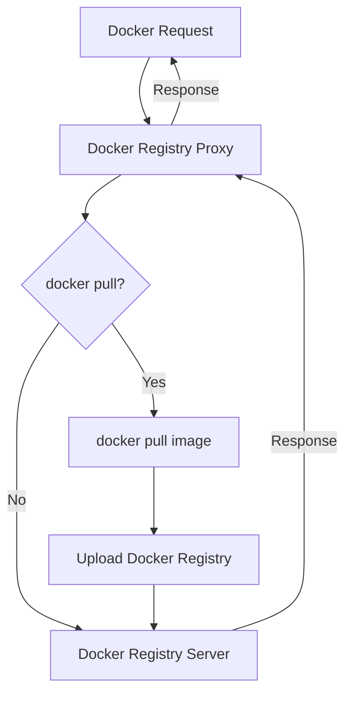

# registry-mirror-proxy

English | [简体中文](./i18n/README.zh-cn.md)

Proxy Registry API

## Features:

1. Intercept Docker Pull Image requests, synchronize the Image to Docker Registry, and then return the Image.

## Upcoming Features

1. npm Registry API 

## Principle

## Credits

This project was inspired by the [shencangsheng/easy-registry-mirror](https://github.com/shencangsheng/easy-registry-mirror) available in the GitHub project.

## License

A short snippet describing the license (MIT)

MIT © Cangsheng Shen