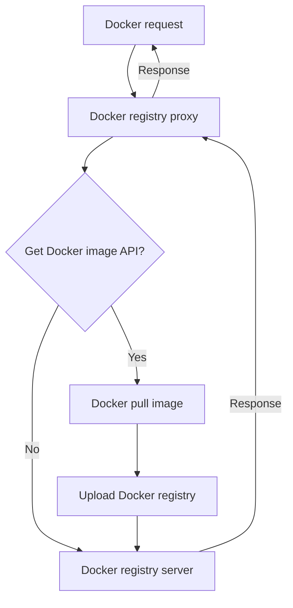

# registry-mirror-proxy

[English](https://github.com/shencangsheng/registry-mirror-proxy) | 简体中文

代理自建 Registry API

## Features:

1. 拦截 Get Docker image API，将 image 同步到 Docker registry，再将请求转发到 registry server

## Principle

## Credits

This project was inspired by the [shencangsheng/easy-registry-mirror](https://github.com/shencangsheng/easy-registry-mirror) available in the GitHub project.

## License

A short snippet describing the license (MIT)

MIT © Cangsheng Shen